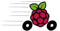

#  amos-ss17-proj4 

### Raspberry Pi as a simulated car

This project aims to provide a [UDS](https://en.wikipedia.org/wiki/Unified_Diagnostic_Services) mocking system based on a Raspberry Pi (+ CAN shield) driven by Lua scrips. 

[Planning Document](https://goo.gl/ummYm7)   
[C++ style guide](https://google.github.io/styleguide/cppguide.html)  
[Link to Travis-CI](https://travis-ci.org/christian-reintges/amos-ss17-proj4)  
[_Selene_ Lua C++ Binding](Selene)  

### Requirements

 Tool / Library   | Version
----------------- | ------------------
Lua               | >= 5.2
C++ compiler      | >= ISO C++14
SocketCAN         | >= git 2017/02/14
CppUnit (optional)| >= 1.10

For instructions to set up all necessary installations, read the [HACKME](HACKME.md).
