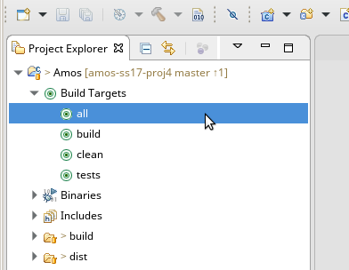

# How-To Set Up Eclipse

1. Download and install the Eclipse IDE with C/C++ Plug-In

2. Click _File_ -> _New_ -> _Makefile Project with Existing Code_

3. Enter a project name and your project path and set the following settings:

4. Add a Build-Target according to the following figure:

5. Enter a Target name (e.g. `all`, `build`, `clean`, `tests`)

6. Double Click on `all` and the entire project is getting build

7. Right click on the Project Folder _Run As_ -> _Run Configurations..._ **OR** Click on the drop-down Entry right next to the green "Play" symbol in the Tool-Bar and click _Run Configurations..._.

8. Set the configuration as shown in the following figure:

9. Now you can run the program simply by clicking on the green "Play" symbol in the Tool-Bar.

